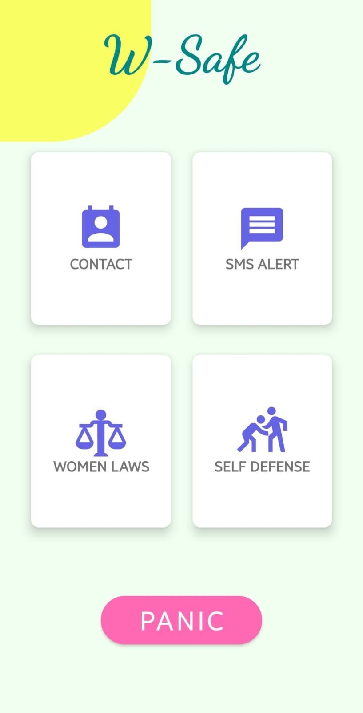
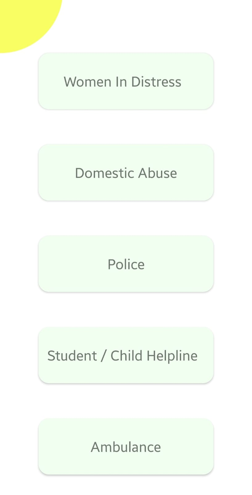
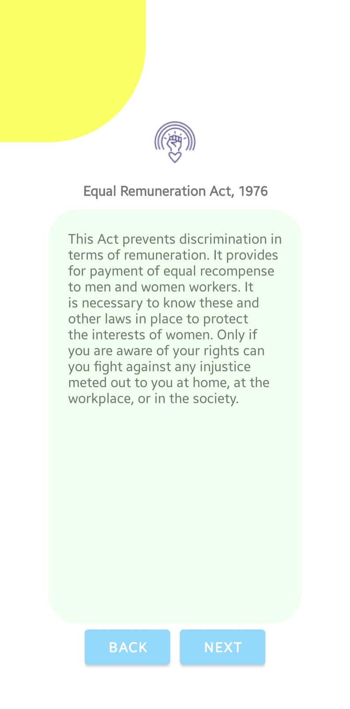
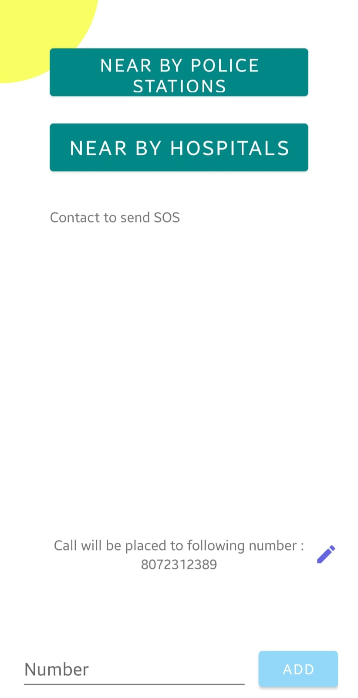
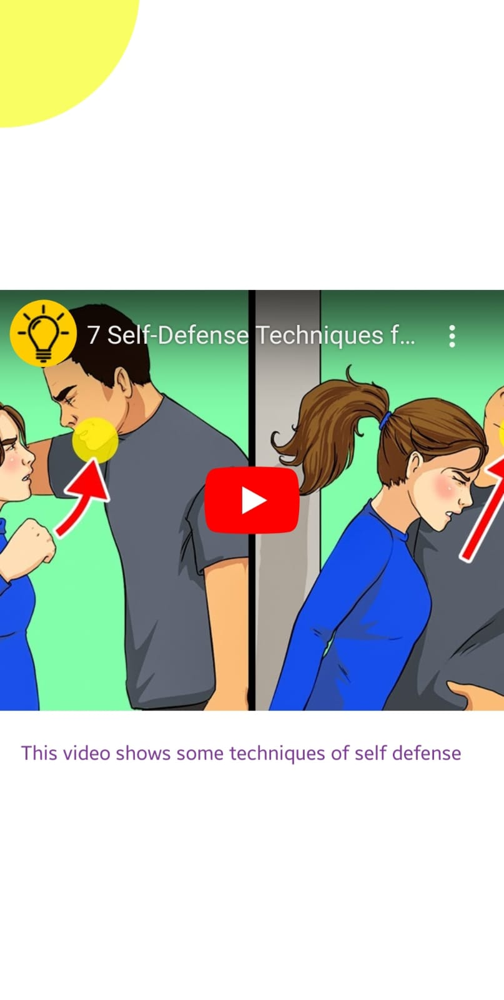

# ⚡ W Safe - A Women Safety Application
## _Feel Safe Everywhere_

W-Safe is a comprehensive women safety application designed to empower and protect women in times of distress. This Android application combines advanced features to provide a reliable safety solution. With W-Safe, women can feel more confident and secure, knowing that help is just a tap away. It is built using Java in Android Studio.

## Full project code available with [Video Demo](www.youtube.com), [Report] and [PPT]

### Screenshots
Home Page | Helplines | Laws
:------------------:|:-------------------:|:-------------------:
 |  |  

Laws Displayed | Contacts Adapter | Self Defense
:------------------:|:-------------------:|:-------------------:
 |  | 

### Key Features
- Shake Detector: Trigger emergency actions by shaking the device 5 times, such as sending SOS alerts and activating the siren.
- GPS Tracking: Retrieve the user's last known location and share it with registered contacts for quick assistance.
- SOS Messaging: Send distress messages to multiple registered contacts, notifying them of the user's situation and location.
- Siren Sound: Attract attention and deter potential threats by activating a loud siren sound.
- Find Nearby Police Stations and Hospitals: Quickly locate the nearest police stations and hospitals in case of emergencies.
- Women Safety Laws: Access information on relevant laws and regulations to stay informed and empowered.
- Self Defense Videos: Watch short instructional videos on self-defense techniques during critical situations.
- National Helplines: Directly call 5 national helpline numbers for immediate support and guidance.
- Panic button: Emergency Calling to a registered mobile number.

### Installation
- Clone the repository: git clone https://github.com/your-username/w-safe.git
- Open the project in Android Studio.
- Build and run the application on your Android device or emulator.

### Usage
1. Launch the W-Safe application on your Android device.
2. Grant Permissions and Register Emergency contacts. 
3. Familiarize yourself with the features and functionalities provided.
4. In case of an emergency, press the panic button or shake the device to activate the SOS alert.
5. The application will send distress messages to your registered contacts along with your current location.
6. Stay aware of nearby police stations and hospitals using the respective features.
7. Refer to the women safety laws and self-defense videos for additional support and knowledge.

### Contributing
We welcome contributions to enhance the functionality and usability of W-Safe. To contribute, follow these steps:

0. Star <a href="https://github.com/AkashSingh3031/The-Complete-FAANG-Preparation" title="this">this</a> repository.

1. Fork <a href="https://github.com/AkashSingh3031/The-Complete-FAANG-Preparation" title="this">this</a> repository.

2. Clone the forked repository.
```css
git clone https://github.com/<your-github-username>/WSafe-Women-Safety-Application
```
  
3. Navigate to the project directory.
```py
cd WSafe-Women-Safety-Application
```

4. Create a new branch.
```css
git checkout -b <your_branch_name>
```

5. Make changes.

6. Stage your changes and commit
```css
git add -A

git commit -m "<your_commit_message>"
```

7. Push your local commits to the remote repo.
```css
git push -u origin <your_branch_name>
```

8. Create a <a href="https://docs.github.com/en/github/collaborating-with-pull-requests/proposing-changes-to-your-work-with-pull-requests/creating-a-pull-request" title="Pull Request">Pull-Request</a> to `develop` !

9. Congratulations! 🎉 Sit and relax, you've made your contribution. ✌️ ❤️ 💥


### Fork the repository.
1. Create a new branch: git checkout -b feature/your-feature-name
2. Make your changes and commit them: git commit -m 'Add some feature'
3. Push the changes to your branch: git push origin feature/your-feature-name
4. Submit a pull request.

#### Prerequisites :
- Android Studio
- Java
- XML

## Build and Run Application

###### WSafe - A Women Safety Application 
